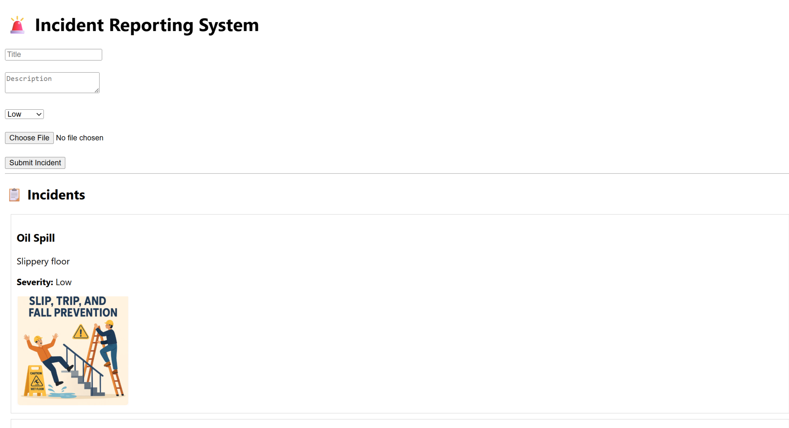
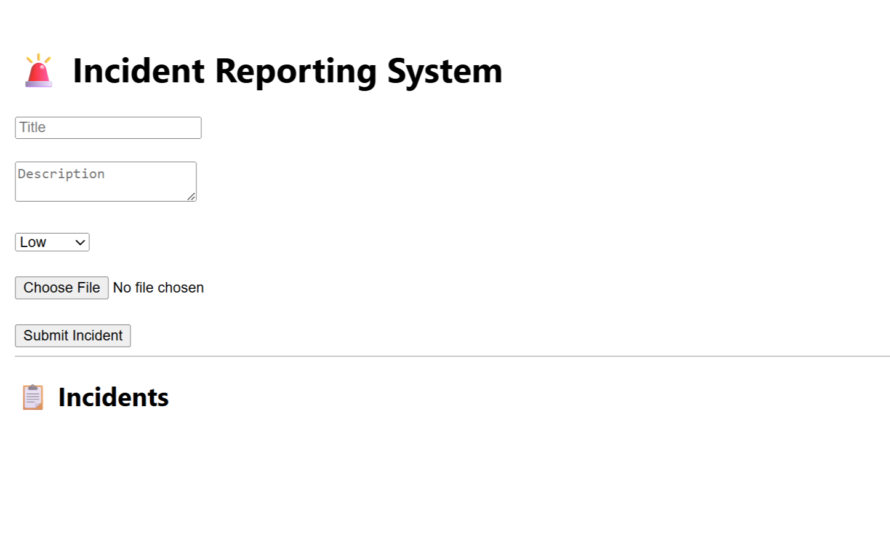
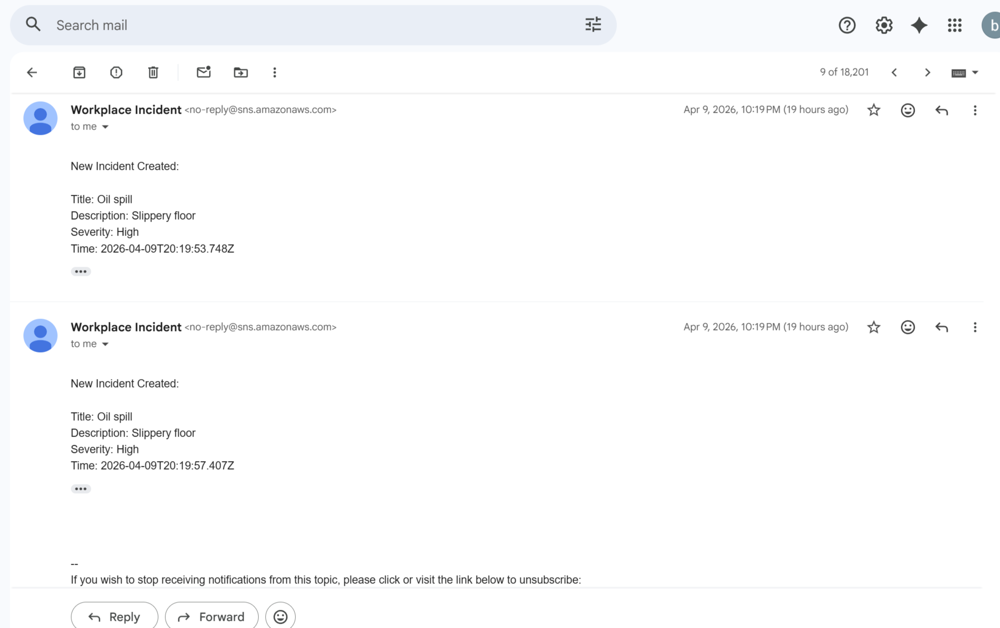
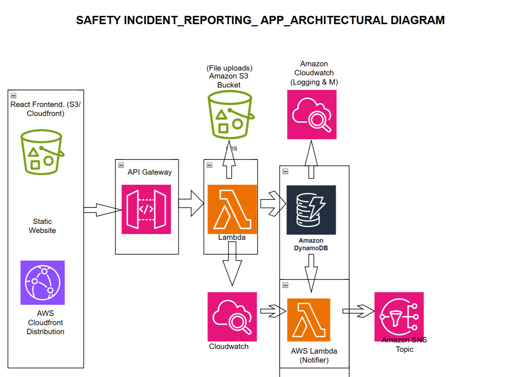

### POST /incident

Creates a new incident.

#### Request body
```json
{
  "title": "Oil spill",
  "description": "Slippery floor near machine",
  "severity": "High",
  "file": "base64-encoded-image"
}
```

#### Response
```json
{
  "message": "Incident created successfully",
  "incidentId": "1234567890-abcd",
  "fileUrl": "https://bucket-name.s3.eu-west-2.amazonaws.com/file.jpg"
}
```# Cloud-Based Safety Incident Reporting System

A full-stack serverless web application for reporting and managing workplace safety incidents with image evidence upload.

## Overview

This project allows users to:

- Submit safety incidents
- Upload image evidence
- Store incident records in DynamoDB
- Store uploaded files in S3
- Retrieve all incidents through an API
- View incidents from a React frontend dashboard

## Architecture

React Frontend  
→ API Gateway  
→ AWS Lambda  
→ DynamoDB + S3

## Tech Stack

### Frontend
- React
- Fetch API

### Backend
- AWS Lambda (Node.js)
- Amazon API Gateway
- Amazon DynamoDB
- Amazon S3

## Features

- Incident creation
- Severity levels: Low, Medium, High
- Image upload using base64
- Data validation
- Incident listing
- Public image access for testing/demo

## API Endpoints

### POST /incident

Creates a new incident.

#### Request body
```json
{
  "title": "Oil spill",
  "description": "Slippery floor near machine",
  "severity": "High",
  "file": "base64-encoded-image"
}
### GET /incidents

Returns all incidents.

#### Response
```json
[
  {
    "incidentId": "1234567890-abcd",
    "title": "Oil spill",
    "description": "Slippery floor near machine",
    "severity": "High",
    "status": "OPEN",
    "createdAt": "2026-03-31T06:36:50.470Z",
    "imageUrl": "https://bucket-name.s3.eu-west-2.amazonaws.com/file.jpg"
  }
]
```


## Architecture

The system follows a serverless architecture:

User (Browser)
   ↓
React Frontend
   ↓
API Gateway
   ↓
AWS Lambda
   ↓
DynamoDB (metadata storage)
   ↓
S3 (image storage)

Monitoring & Alerts:
- CloudWatch (logging & monitoring)
- SNS (real-time notifications)


## Monitoring, Logging & Alerts

- Implemented logging using AWS CloudWatch to monitor Lambda execution and debug errors
- Used console.log and console.error for structured logging and tracing
- Integrated Amazon SNS to send real-time email notifications when new incidents are created
- Designed the system to handle notification failures gracefully using try/catch without affecting core functionality


## Key Features

- Create and manage workplace safety incidents
- Upload and store image evidence using Amazon S3
- Store structured incident data in DynamoDB
- Real-time incident retrieval via REST API
- Serverless backend using AWS Lambda
- Real-time email notifications using SNS
- Centralized logging and monitoring using CloudWatch
- Input validation and error handling


## System Flow

1. User submits incident via React frontend
2. API Gateway receives the request
3. Lambda processes the request:
   - Validates input
   - Uploads image to S3 (if provided)
   - Stores incident data in DynamoDB
   - Sends notification via SNS
4. CloudWatch logs all operations for monitoring
5. Response is returned to the frontend


## AWS Services Used

- AWS Lambda – serverless compute for backend logic
- Amazon API Gateway – REST API management
- Amazon DynamoDB – NoSQL database for incident data
- Amazon S3 – object storage for uploaded images
- Amazon CloudWatch – logging and monitoring
- Amazon SNS – real-time notification service
- IAM – access control and permissions


## Challenges & Solutions

- CORS Issues:
  Resolved cross-origin errors by enabling CORS in API Gateway for GET and POST methods

- Module Compatibility:
  Handled ES module vs CommonJS issues in Lambda runtime

- DynamoDB Validation Errors:
  Ensured correct partition key (incidentId) was always included

- SNS Authorization Error:
  Fixed permission issue by attaching SNS publish policy to Lambda execution role

- Error Handling:
  Implemented try/catch around SNS to prevent failures from affecting main API flow


## Screenshots

### User Interface


### Incident List


### SNS Notification


### Architecture Diagram

